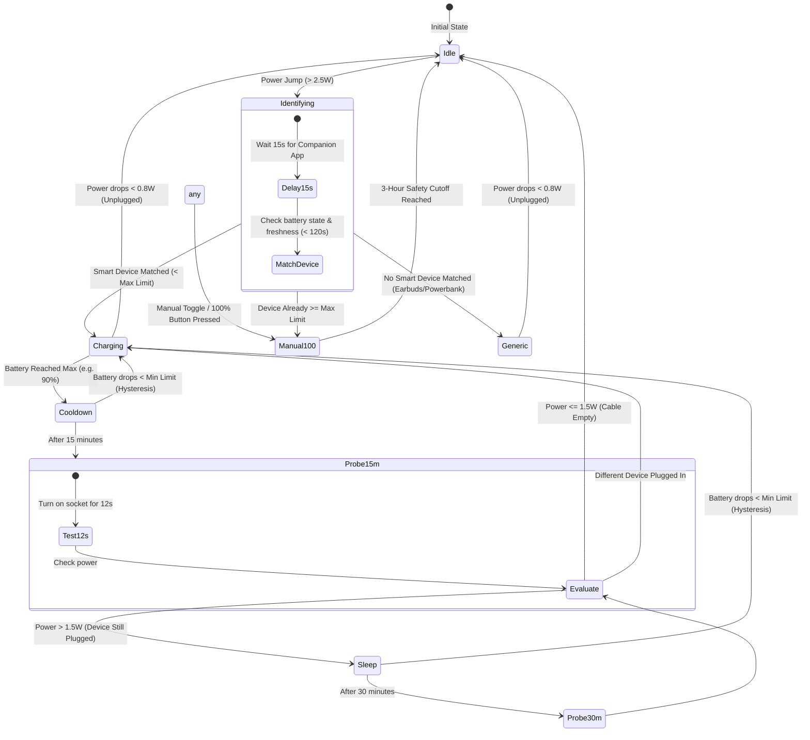

# Smart Charging for Home Assistant

[](https://hacs.xyz/)
[](https://www.home-assistant.io/)
[](LICENSE)

An intelligent, battery-preserving smart charging system for Home Assistant that combines an **asynchronous backend state machine** (`custom_components/smart_charger`) with **native Lovelace cards** (`ha-smart-charging-card.js`) designed to match the clean aesthetic of [ha-plugins](https://github.com/grigorii-horos/ha-plugins).

---

## ⚡ Overview

Lithium-ion batteries degrade fastest when held at 100% charge while hot. Standard smart plugs either leave chargers running indefinitely or rely on primitive wattage cutoffs that don't know what device is plugged in or what its current battery level is.

**Smart Charging solves this:**
- Dynamically identifies which device (phone, watch, tablet) was just plugged into a shared socket.
- Charges within an optimal battery health range (e.g., **70% – 90%** for phones/tablets, **40% – 75%** for smartwatches).
- Automatically turns off the socket when the target limit is reached.
- Periodically probes the cable (**15m / 30m cycles**) to know when the device is unplugged or still resting.
- Automatically tops up if the battery drops below the minimum limit while still plugged in (**hysteresis**).
- Supports manual override to **100%** at any time with a 3-hour safety cutoff.
- Provides beautiful Lovelace cards with real-time wattage, connected device badges, and battery progress bars.

---

## 📱 Lovelace Cards

Built with **Lit + TypeScript** utilizing Home Assistant's native component hierarchy (`ha-tile-container`, `ha-tile-icon`, `ha-tile-info`, `renderLevels`, and HA CSS design tokens).

### 1. Overview List Card: `custom:horos-chargers-card`
Shows all your charging sockets in a single clean overview card with real-time connected device badges, power draw, battery progress bars with limit markers, and quick 100% / power toggle controls.

```
┌─────────────────────────────────────────────────────────────┐
│  ⚡  Умная зарядка                                    1 / 2  │
├─────────────────────────────────────────────────────────────┤
│  🔌  Розетка в гостиной   [ 📱 Телефон Григория ]    [ 100% ] │
│      Зарядка · 14.2 W                                  [◉]  │
│      [███████████████████████████░░░|░░░░░] 88% / 90%       │
├─────────────────────────────────────────────────────────────┤
│  🔌  Розетка для часов    [ Свободно ]               [ 100% ] │
│      Свободно · 0 W                                    [○]  │
└─────────────────────────────────────────────────────────────┘
```

#### Card Configuration
```yaml
type: custom:horos-chargers-card
title: Умная зарядка
chargers:
  - entity: sensor.rozetka_v_gostinoi_status
    name: Розетка в гостиной
  - switch: switch.device_usb_plug_3_ports_livingroom_l2
    name: Часы (кредл)
```
*(If `chargers` is omitted, the card automatically discovers all `smart_charger` entities on your system!)*

---

### 2. Single Charger Tile: `custom:horos-charger-tile`
A standalone tile that fits seamlessly into grid and sections dashboards, providing big value readings for power draw and battery level, plus level row progress bars and action chips.

```yaml
type: custom:horos-charger-tile
entity: sensor.rozetka_v_gostinoi_status
name: Розетка в гостиной
```

Or using raw entity bindings:
```yaml
type: custom:horos-charger-tile
switch: switch.device_plug_livingroom
power: sensor.device_plug_livingroom_power
name: Розетка в гостиной
```

---

## 🧠 Charging Algorithm & State Machine



---

## 🚀 Installation

### Option 1: Via HACS (Recommended)
1. Open **HACS** in Home Assistant.
2. Click **⋮** (top right) → **Custom repositories**.
3. Add repository URL: `https://github.com/grigorii-horos/ha-smart-charging`.
4. Category: **Integration** (or **Dashboard** for frontend card only).
5. Click **Install** and restart Home Assistant.

### Option 2: Manual Installation
1. Copy `custom_components/smart_charger/` to your Home Assistant directory:
   `<config>/custom_components/smart_charger/`
2. Copy `dist/ha-smart-charging-card.js` to `<config>/www/ha-smart-charging-card.js`.
3. In Home Assistant: **Settings** → **Dashboards** → **⋮** → **Resources** → Add `/local/ha-smart-charging-card.js` as a **JavaScript Module**.
4. Restart Home Assistant.

---

## ⚙️ Configuration (UI)

1. In Home Assistant, navigate to **Settings** → **Devices & Services** → **Add Integration**.
2. Search for **Smart Charger**.
3. **Step 1 — Socket**:
   - **Charger Name**: e.g. `Розетка в гостиной`
   - **Power Switch**: `switch.device_plug_livingroom`
   - **Power Sensor**: `sensor.device_plug_livingroom_power`
4. **Step 2 — Devices**:
   - Add your devices (phone, watch, tablet) using their Home Assistant Companion App sensors:
     - **Battery Level Sensor**: e.g. `sensor.phone_grigorii_battery_level`
     - **Battery State Sensor**: e.g. `sensor.phone_grigorii_battery_state`
     - **Charger Type Sensor**: e.g. `sensor.phone_grigorii_charger_type`
     - **Min Charge Limit (%)**: e.g. `70`
     - **Max Charge Limit (%)**: e.g. `90`
     - **Exclusive Switch** (optional): dedicated cradle socket (e.g. watch charging dock)

---

## 🛠️ Created Entities & Services

### Entities
- `sensor.<name>_status`: Main status sensor reporting `idle`, `charging`, `cooldown`, `sleep`, `manual_100`, or `generic`, with rich attributes:
  - `power_w`: real-time power draw
  - `connected_device`: current identified device name
  - `battery_level`: device battery percentage
  - `min_charge` / `max_charge`: target limits
  - `is_probing`: boolean probe test indicator
- `button.<name>_force_100`: Force charge to 100%
- `button.<name>_stop`: Stop charging immediately
- `switch.<name>_power`: Power switch entity

### Services
- `smart_charger.force_100`: Force charge socket to 100% (with 3-hour safety cutoff).
  ```yaml
  action: smart_charger.force_100
  data:
    charger_id: switch.device_plug_livingroom
  ```
- `smart_charger.stop`: Turn off charging socket and cancel active timers.
  ```yaml
  action: smart_charger.stop
  data:
    charger_id: switch.device_plug_livingroom
  ```

---

## 💻 Development & Building

```bash
# Clone the repository
git clone https://github.com/grigorii-horos/ha-smart-charging.git
cd ha-smart-charging/cards

# Install dependencies
npm install

# Build production bundle
npm run build

# Deploy directly to your Home Assistant host
python3 ../script/publish.py
```

---

## 📄 License

MIT © [Grigorii Horos](https://github.com/grigorii-horos)
